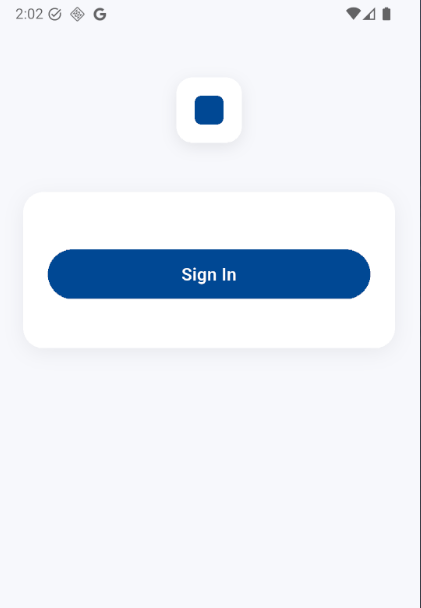

# onu_devkit

A lightweight internal Flutter devkit for building apps faster through reusable UI components, utilities, and design tokens.

The goal is simple: **stop rewriting the same UI logic across projects.**

---

# Features

- Reusable UI components (buttons, inputs, images)
- Design tokens (spacing, radius, animations, shadows)
- Common validators
- Helpful extensions
- Consistent architecture for Flutter apps

This kit is continuously evolving as I build more Flutter projects.

---

# Installation

Add the package to your Flutter project via GitHub:
```yaml
dependencies:
  onu_devkit:
    git:
      url: https://github.com/augustineonu/onu_devkit.git
```

Then run:
```bash
flutter pub get
```

Import the devkit in your project:
```dart
import 'package:onu_devkit/onu_devkit.dart';
```

## Example Usage

### Button
```dart
AppButton(
  text: "Continue",
  onPressed: () {},
)
```

### Text Input
```dart
AppTextInput(
  labelText: "Email",
  hintText: "Enter your email",
)
```

## Theme Access Rule

### Problem
`get` (GetX) and `onu_devkit` both add extension methods on `BuildContext`
with the same names (`textTheme`, `colorScheme`, etc.).

This causes a compiler error:
> "A member named 'textTheme' is defined in 'extension ContextExtensionss 
> on BuildContext' (from **get** package) and 'extension BuildContextExt on 
> BuildContext' (from **onu_devkit**), and neither is more specific."

### Rule
**Never use `context.textTheme` or `context.colorScheme` in this project.**

Always access theme data the Flutter-native way:
```dart
// ✅ Correct — always do this
final theme = Theme.of(context);
final colorScheme = theme.colorScheme;

theme.textTheme.bodySmall
theme.textTheme.titleMedium
colorScheme.primary
colorScheme.onSurface

// ❌ Never do this — ambiguous between get and onu_devkit
context.textTheme.bodySmall
context.colorScheme.primary
```

### Why not just remove the conflict?
- `get` ships `ContextExtensionss` and it cannot be tree-shaken
- `onu_devkit` is our own package — but fixing it there breaks other 
  projects that don't use `get`
- `Theme.of(context)` is the Flutter-native approach and works 
  everywhere regardless of packages installed

## Architecture
```
lib
 ├── onu_devkit.dart
 └── src
     ├── tokens
     │   ├── app_radius.dart
     │   ├── app_spacing.dart
     │   ├── app_duration.dart
     │   └── app_shadow.dart
     ├── primitives
     │   ├── app_container.dart
     │   ├── app_icon.dart
     │   └── app_text.dart
     ├── components
     │   ├── buttons
     │   │   └── app_button.dart
     │   ├── inputs
     │   │   └── app_text_input.dart
     │   ├── images
     │   │   └── app_network_image.dart
     │   └── appbar
     │       └── app_appbar.dart
     ├── validators
     │   └── app_validators.dart
     └── extensions
         ├── context_ext.dart
         └── string_ext.dart
```

## Philosophy

The devkit focuses on:

- **Reusability**
- **Consistency**
- **Developer speed**

> Brand styling such as colors and fonts should live in the app layer, not the devkit.

## Roadmap

Planned additions:

- Form helpers
- Dialog system
- Snackbars
- Date selectors
- Skeleton loaders

## Contributions

This project is currently evolving as I build more Flutter applications. Ideas, suggestions, and improvements are welcome.

## Screenshots

| Button | Text Input | Swipe Action Button |
|--------|------------|---------------------|
|  |  |  |